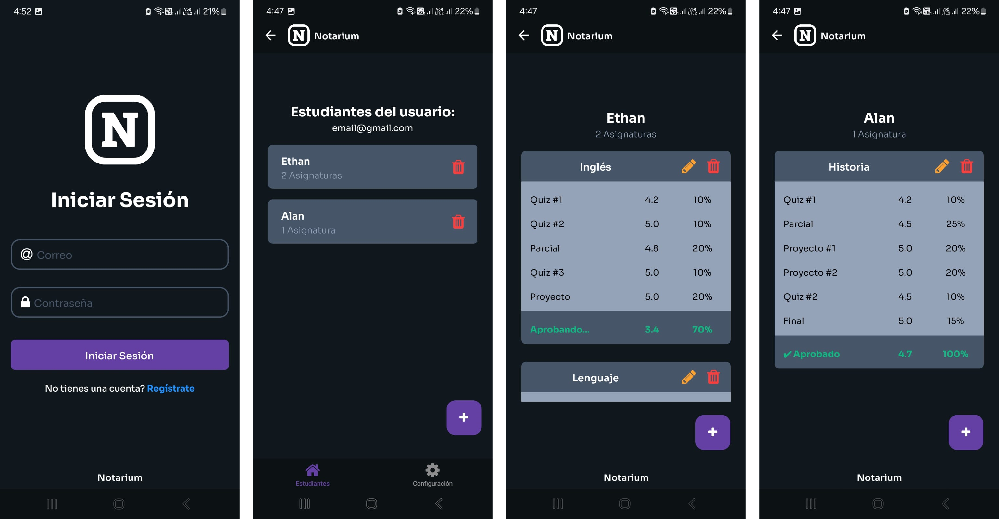

<!DOCTYPE html>
<html lang="en">
<head>
  <meta charset="UTF-8">
  <meta name="viewport" content="width=device-width, initial-scale=1.0">
</head>
<body>
  <h1>Notarium 📔</h1>
  
<b>Notarium</b> es un sistema de gestión de notas académicas diseñado para simplificar el seguimiento y análisis del rendimiento estudiantil. Este software permite registrar estudiantes, asignaturas y configurar sus calificaciones, como sus parámetros, notas y porcentajes, permite calcular promedios y generar reportes en PDF detallados.

  

  

  <!-- Características principales -->
  <h2>🚀 Características principales</h2>
  <ul>
    <li><strong>📚 Gestión de estudiantes</strong>: Registra, actualiza y elimina estudiantes fácilmente.</li>
    <li><strong>📝 Evaluaciones personalizadas</strong>: Define evaluaciones con diferentes pesos para cada asignatura.</li>
    <li><strong>📊 Informes y Estadísticas</strong>: Análisis de rendimiento y progreso académico.</li>
    <li><strong>📂 Reportes dinámicos</strong>: Crea reportes en PDF para cada estudiante.</li>
    <li><strong>✨ Interfaz intuitiva</strong>: Sistema simple y fácil de usar para docentes y estudiantes.</li>
    <li><strong>🔒 Seguridad y Encriptación</strong>: Protección con datos encriptados.</li>
  </ul>

  

  
  <!-- Uso -->
  <h2>✨ Beneficios Clave</h2>
  <h3>1. Ahorro de Tiempo</h3>
  
Procesos automatizados y eficientes.

  <h3>2. Análisis de Datos</h3>
  
Informes detallados en PDF

  <h3>3. Flexibilidad de Parámetros</h3>
  
Parámetros de porcentajes personalizables.

  

  <!-- Instalación -->
  <h2>📦 Instalación</h2>
  <ol>
    <li>
      
<strong>Clonar el repositorio:</strong>

      <pre><code>git clone https://github.com/Estebanespg/NotariumMobileApp.git</code></pre>
    </li>
    <li>
      
<strong>Acceder al proyecto:</strong>

      <pre><code>cd NotariumMobileApp</code></pre>
    </li>
    <li>
      
<strong>Instalar dependencias:</strong>

      <pre><code>npm install</code></pre>
    </li>
    <li>
      
<strong>Ejecutar el proyecto:</strong>

      <pre><code>npm start</code></pre>
    </li>
    <li>
      
<strong>Escanea el código QR y pruébala con Expo Go</strong>

    </li>
  </ol>

  

  <!-- Uso -->
  <h2>📝 Uso</h2>
  <h3>1. Registro de estudiantes</h3>
  
Agrega estudiantes al sistema con sus datos básicos y asignaturas.

  <h3>2. Gestión de evaluaciones</h3>
  
Configura evaluaciones, define pesos y añade calificaciones.

  <h3>3. Generación de reportes</h3>
  
Exporta reportes detallados en formato PDF con las calificaciones por asignatura. <a href="assets/ReporteEstudiantes.pdf">Ver PDF de ejemplo</a>

  

  <!-- Tecnologías utilizadas -->
  <h2>🛠️ Tecnologías utilizadas</h2>
  <ul>
    <li><strong>Lenguaje:</strong> Javascript</li>
    <li><strong>Librerías:</strong>
      <ul>
        <li>React Native: Framework para apps móviles con JavaScript.</li>
        <li>Expo: Plataforma para simplificar React Native.</li>
        <li>Native Wind: Estilos Tailwind CSS en React Native.</li>
        <li>Firebase: Base de datos y Autenticación de Google.</li>
      </ul>
    </li>
  </ul>

  

  <!-- Autor -->
  <h2>👥 Autor</h2>
  <ul>
    <li><strong>Esteban Pérez:</strong> Desarrollador y creador de Notarium.</li>
  </ul>
</body>
</html>
